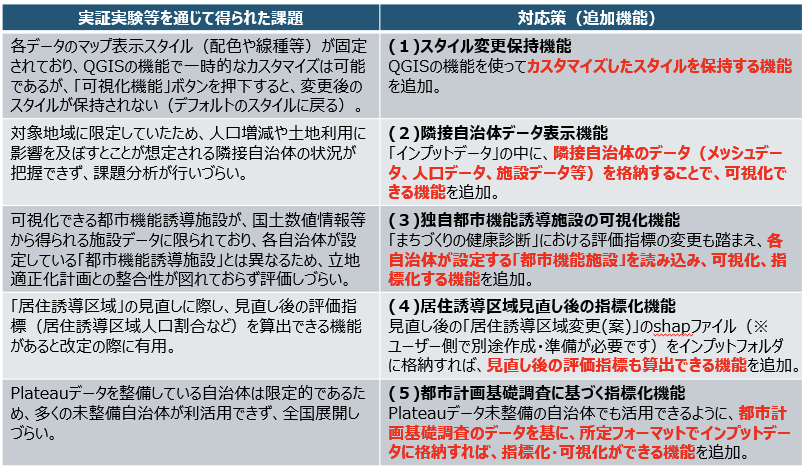
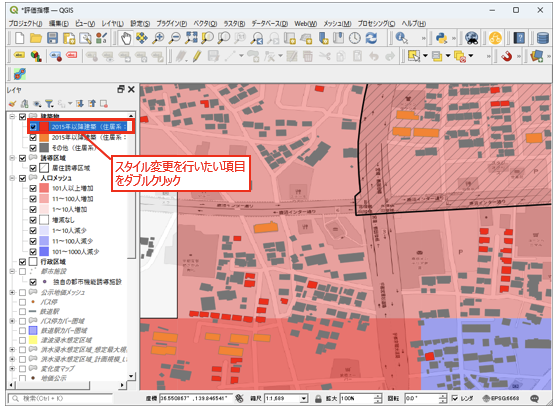
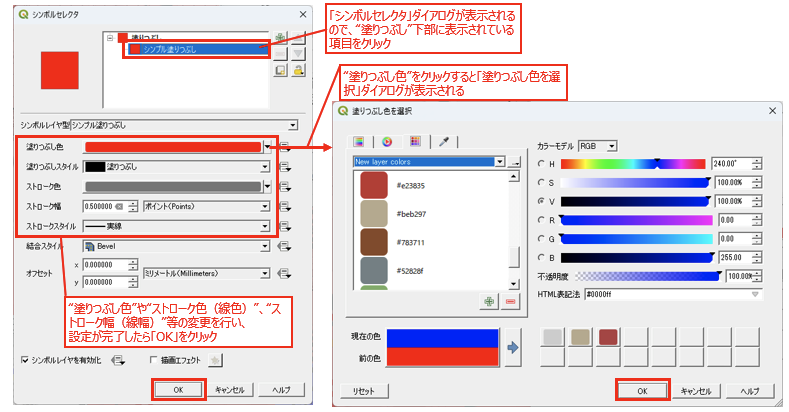
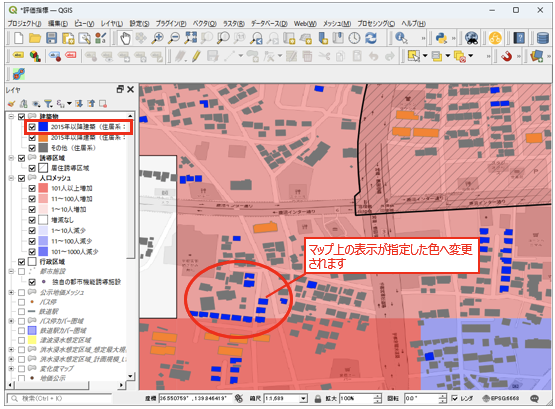
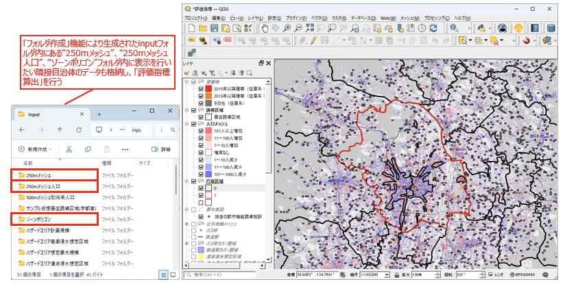
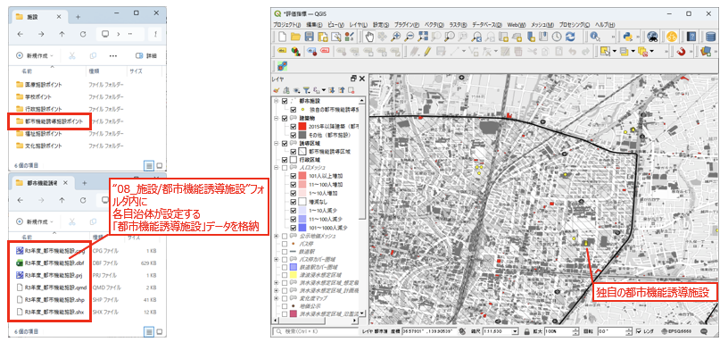
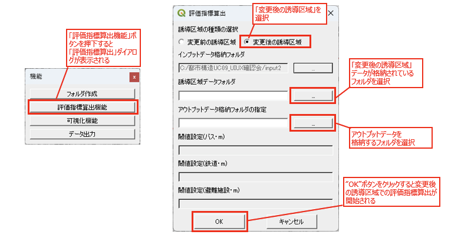
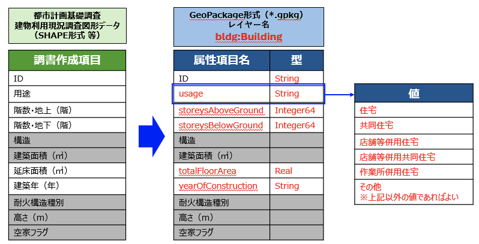
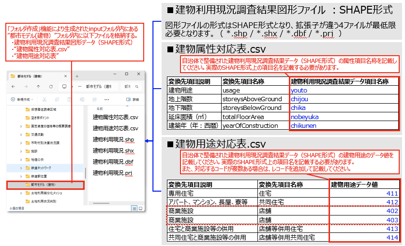

# 応用操作マニュアル

# 1 本書について

本書では、都市構造評価ツールの拡張機能と応用操作手順について記載しています。
基本的な操作手順については下記を参照ください。
- [基本操作マニュアル](userMan.md)
- [操作マニュアルPDF](../resources/操作マニュアル参考資料.pdf)

# 2 拡張機能の概要

実証実験や事前体験会を通じて把握された課題に対し、以下の拡張機能を追加しました。

# 3 応用操作手順

## 3-1 スタイル変更保持機能

QGISの機能を使ってカスタマイズしたマップ表示スタイル（配色や線種等）を保持する機能です。 
昨年度は、各データのマップ表示スタイル（配色や線種等）が固定されており、QGISの機能で一時的なカスタマイズは可能であるものの、「可視化機能」ボタンを押下するとデフォルトのスタイルに戻ってしまう課題がありました。 
本機能により、「可視化機能」ボタンを押下してもカスタマイズしたスタイルが維持されます。

### 操作手順

1. レイヤパネルから、スタイル変更を行いたい項目をダブルクリックします。
    

2. 「シンボルセレクタ」ダイアログが表示されるので、"塗りつぶし"下部に表示されている項目をクリックします。

3. "塗りつぶし色"をクリックすると「塗りつぶし色を選択」ダイアログが表示されます。

4. "塗りつぶし色"や"ストローク色（線色）"、"ストローク幅（線幅）"等の変更を行い、設定が完了したら「OK」をクリックします。

    

5. マップ上の表示が指定した色へ変更されます。変更したスタイルは「可視化機能」ボタンを押下しても保持されます。

    

## 3-2 隣接自治体データ表示機能

「インプットデータ」の中に隣接自治体のデータ（メッシュデータ、人口データ、施設データ等）を格納することで、隣接自治体のデータも可視化できる機能です。

### 操作手順

1. 「フォルダ作成」機能により生成されたインプットフォルダ内にある以下のフォルダに、表示を行いたい隣接自治体のデータも格納します。
    - 10_250mメッシュ
    - 11_250mメッシュ人口
    - 02_ゾーンポリゴン

2. 「評価指標算出」を実行すると、隣接自治体のデータも含めて可視化されます。

    

## 3-3 独自都市機能誘導施設の可視化機能

「まちづくりの健康診断」における評価指標の変更も踏まえ、各自治体が設定する「都市機能誘導施設」を読み込み、可視化・指標化する機能です。

### 操作手順

1. インプットフォルダ内の 08_施設/都市機能誘導施設 フォルダに、各自治体が設定する「都市機能誘導施設」データを格納します。

2. 「評価指標算出」を実行すると、独自の都市機能誘導施設が可視化・指標化されます。

    

## 3-4 居住誘導区域見直し後の指標化機能

見直し後の「居住誘導区域変更(案)」のshapファイルをインプットフォルダに格納することで、見直し後の評価指標も算出できる機能です。

> [!NOTE]
> 見直し後の「居住誘導区域変更(案)」のshapファイルは、ユーザー側で別途作成・準備が必要です。

### 操作手順

1. 見直し後の居住誘導区域データ（shapファイル）をインプットフォルダに格納します。

2. 「評価指標算出機能」ボタンを押下すると「評価指標算出」ダイアログが表示されます。

3. 誘導区域の種類の選択で「変更後の誘導区域」を選択します。

4. 「変更後の誘導区域」データが格納されているフォルダを選択します。

5. アウトプットデータを格納するフォルダを選択します。

6. 「OK」ボタンをクリックすると、変更後の誘導区域での評価指標算出が開始されます。

    

## 3-5 都市計画基礎調査に基づく指標化機能

PLATEAUデータ未整備の自治体でも活用できるよう、都市計画基礎調査のデータを基に指標化・可視化ができる機能です。 
都市計画基礎調査の建物利用現況調査結果データを所定フォーマットで格納することで利用できます。

### 格納ファイル

「フォルダ作成」機能により生成されたインプットフォルダ内にある 01_都市モデル（建物） フォルダ内に以下のファイルを格納します。

- 建物利用現況調査結果図形データ（SHAPE形式）
- 建物属性対応表.csv
- 建物用途対応表.csv

> [!NOTE]
> 「建物属性対応表.csv」、「建物用途対応表.csv」は「フォルダ作成」機能にて自動的にファイル生成されます。
> 生成されたcsvファイルにデータ対応を記載して保存してください。

### 建物利用現況調査結果図形データ

SHAPE形式の図形ファイルで、拡張子が異なる以下の4ファイルが最低限必要です。

- *.shp
- *.shx
- *.dbf
- *.prj

### 建物属性対応表 / 建物用途対応表の記載

都市計画基礎調査の建物利用現況調査図形データ（SHAPE形式等）の属性項目を、 
GeoPackage形式（レイヤー名：bldg:Building）の属性項目名へ変換するための対応関係を下図に示します。 
赤文字の属性項目名が変換対象となり、usageの値は右側に示す建物用途の値に対応します。

「フォルダ作成」機能により生成されたインプットフォルダ内に、建物利用現況調査結果図形データ（SHAPE形式）、建物属性対応表.csv、建物用途対応表.csvを格納します。 
建物属性対応表.csvには、自治体で整備されたSHAPE形式データの属性項目名称を記載してください。 
建物用途対応表.csvには、建物用途のデータ値を記載してください。対応するコードが複数ある場合は、レコードを追加して記載します。

---
