# 操作マニュアル

# 1 本書について

本書では、都市構造評価ツールの操作手順について記載しています。
本ツールの拡張機能、応用操作については下記を参照ください。
- [操作マニュアル詳細](../resources/操作マニュアル参考資料.pdf)

# 2 使い方

## 2-1 評価指標算出プラグインの起動

1. QGIS画面から、プラグイン > Plateau Statics Visualization Plugin を選択しプラグインを起動します。

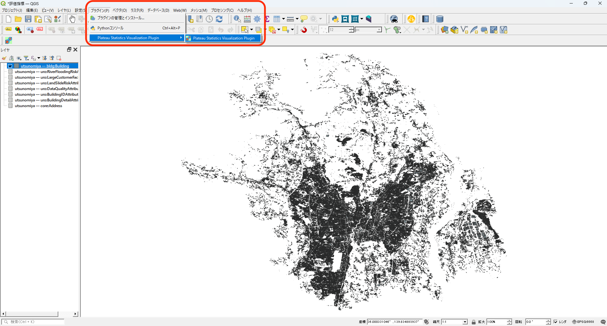

## 2-2 フォルダ生成・評価指標データ格納

1. 機能パネル内の【フォルダ作成】を押下し、インプットデータの格納フォルダを作成します。

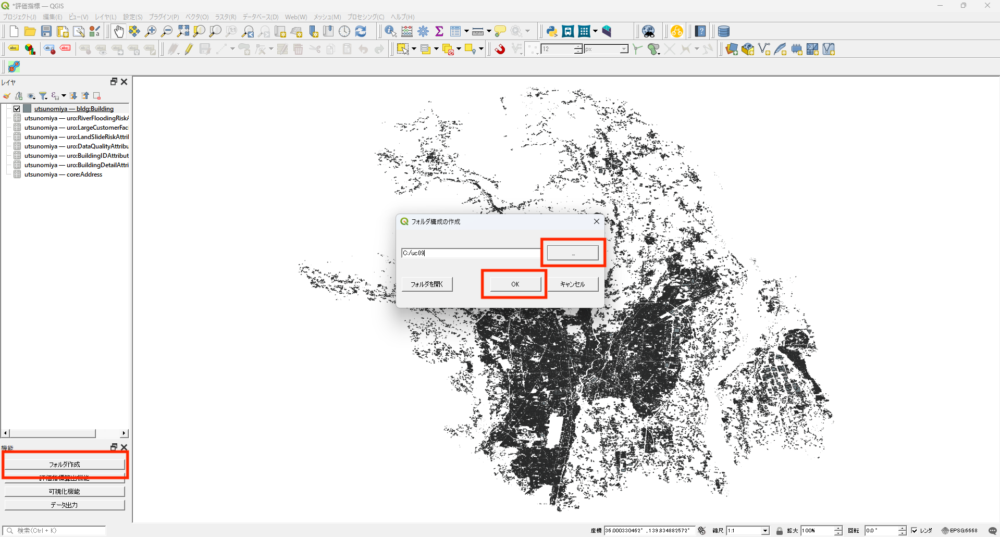

2. フォルダパスを指定し、「OK」ボタンを押下するとフォルダが作成されます。

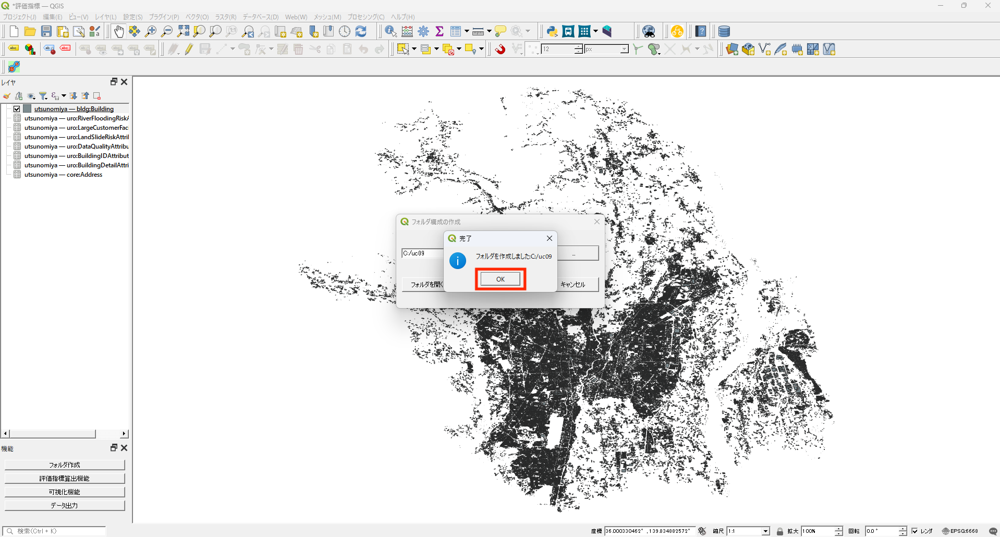

3. 作成されたフォルダにインプットデータを格納します。

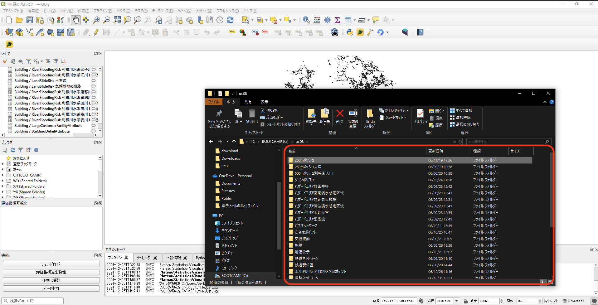

格納するデータの一覧は以下の通りです。

| No. | 格納フォルダ名 | 必須/任意 | 入手先 | 格納データ ※3 |
|-----|-----------|---------|-------|---------|
| 1 | 01_都市モデル（建物） | 必須 | G空間情報センター | PLATEAU GIS ConverterでbldgデータをGeopackage形式へ変換したデータ ※1 |
| 2 | 02_ゾーンポリゴン | 必須 | 国土数値情報 | 行政区域 |
| 3 | 03_鉄道駅位置 | 必須 | 国土数値情報 | 鉄道 |
| 4 | 04_鉄道ネットワーク | 必須 | 国土数値情報 | 鉄道 |
| 5 | 05_バス停 | 必須 | 国土数値情報 | バス停留所 |
| 6 | 06_バスルート | 必須 | 国土数値情報 | バスルート |
| 7 | 07_道路ネットワーク | 必須 | OpenStreetMap | gis_osm_roads_free_1.shp |
| 8 | 08_施設 | 任意 | 国土数値情報、各自治体保有データ | 市区町村役場、市町村役場等及び公的集会施設、文化施設、福祉施設、医療機関、学校 |
| 9 | 09_避難所 | 任意 | 国土数値情報 | 避難施設 |
| 10 | 10_250mメッシュ | 必須 | e-stat | 境界データ>5次メッシュ（250mメッシュ）>世界測地系緯度経度・Shapefile |
| 11 | 11_250mメッシュ人口 | 必須 | e-stat | 統計データ>国勢調査>各年度>5次メッシュ（250mメッシュ） |
| 12 | 12_500mメッシュ別将来人口 | 必須 | 国土数値情報 | 500mメッシュ別将来推計人口 |
| 13 | 13_変化度マップ（建物変化） | 任意 | 国より提供 | 自治体に関連する1次メッシュ単位で格納 |
| 14 | 14_土地利用細分化メッシュ | 任意 | 国土数値情報 | 土地利用細分化メッシュ |
| 15 | 15_ハザードエリア計画規模 | 任意 | 国土数値情報 | 洪水浸水想定区域（1次メッシュ単位）>10_計画規模 |
| 16 | 16_ハザードエリア想定最大規模 | 任意 | 国土数値情報 | 洪水浸水想定区域（1次メッシュ単位）>20_想定最大規模 |
| 17 | 17_ハザードエリア高潮浸水想定区域 | 任意 | 国土数値情報 | 高潮浸水想定区域 |
| 18 | 18_ハザードエリア津波浸水想定区域 | 任意 | 国土数値情報 | 津波浸水想定 |
| 19 | 19_ハザードエリア土砂災害 | 任意 | 国土数値情報 | 土砂災害警戒区域 |
| 20 | 20_ハザードエリア氾濫流 | 任意 | 国土数値情報 | 洪水浸水想定区域（1次メッシュ単位）>41_家屋倒壊等氾濫想定区域_氾濫流 |
| 21 | 21_誘導区域 | 必須 ※2 | 国土交通省_都市計画決定GISオープンデータ | 都市計画情報 |
| 22 | 22_仮想居住誘導区域 | 任意 | 自治体保有データ | 居住誘導区域データがない場合ユーザーにて作成 |
| 23 | 23_地価公示 | 任意 | 国土数値情報 | 地価公示 |
| 24 | 24_空き家ポイント | 任意 | ― | ― |
| 25 | 25_固定資産の価格等の概要調書 | 任意 | 総務省 | 固定資産の価格等の概要調書 |
| 26 | 26_市町村別決算状況調 | 任意 | 総務省 | 市町村別決算状況調 |
| 27 | 27_人口集中地区 | 任意 | 国土数値情報 | 人口集中地区データ |

※1 3D都市モデル（建物データ）のGeopackage形式への変換方法については、環境構築手順書を参照ください。

※2 22_仮想居住誘導区域のデータがある場合は任意となります。

※3 格納データの「xxx>xxx>xxx」の表記はダウンロードサイト上のナビゲーション（パンくずリスト）を示しています。

> [!NOTE]
> No.1〜7, 10〜12のデータは必須です。不足している場合、エラーメッセージが表示され算出処理が終了します。各フォルダのデータ格納状況をご確認ください。
> その他のデータは任意で、未検出時はスキップまたは空データとして処理が継続されます。
> 各データの入手先については環境構築手順書を参照ください。

## 2-3 評価指標の算出

1. 機能パネル内の【評価指標算出機能】を押下し、データの格納フォルダや諸条件を入力します。

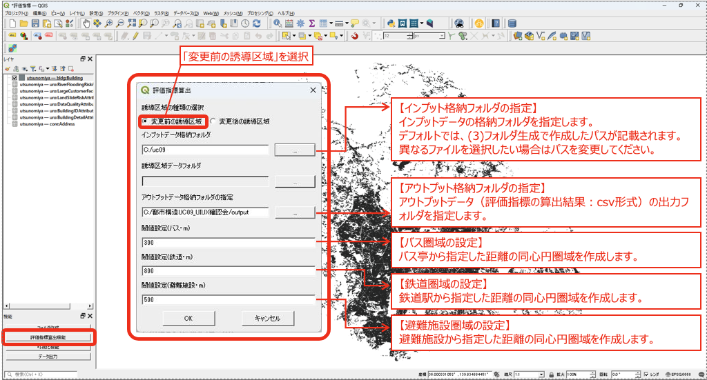

各項目の設定内容は以下の通りです。

- **誘導区域の種類の選択**: 「変更前の誘導区域」を選択します
- **インプット格納フォルダの指定**: インプットデータの格納フォルダを指定します、デフォルトでは、フォルダ生成で作成したパスが記載されます
- **アウトプット格納フォルダの指定**: アウトプットデータ（評価指標の算出結果：csv形式）の出力フォルダを指定します
- **バス圏域の設定**: バス停から指定した距離の同心円圏域を作成します
- **鉄道圏域の設定**: 鉄道駅から指定した距離の同心円圏域を作成します
- **避難施設圏域の設定**: 避難施設から指定した距離の同心円圏域を作成します

2. 「OK」を押下すると、「集計対象市町村選択」ダイアログが表示されます。評価指標算出を行う市町村を選択し、「OK」を押下するとインプットデータの取り込み、指標の算出処理が実行されます。

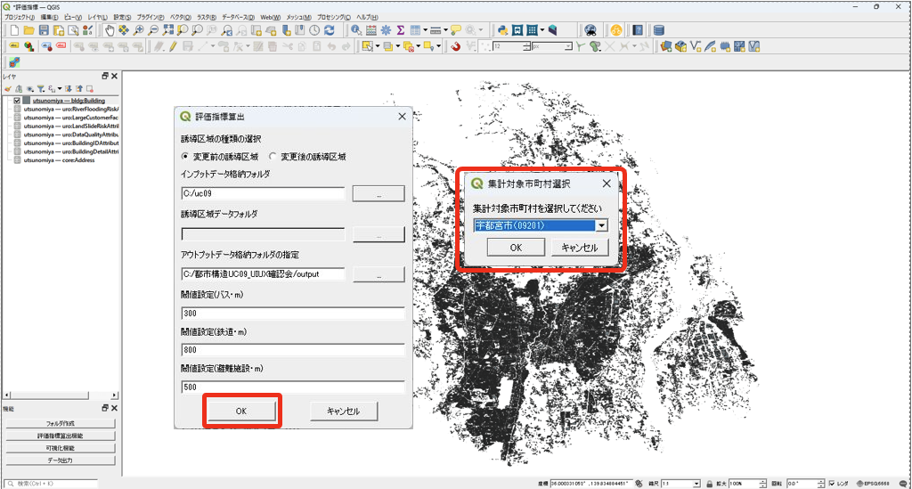

3. 演算処理が完了したら「完了」ダイアログが表示されます。「OK」を押下すると「評価指標の算出」の完了です。

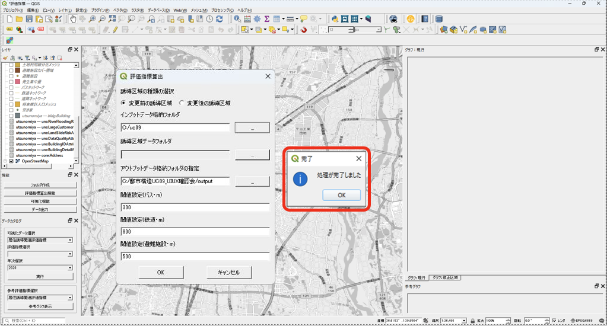

## 2-4 可視化

1. 評価指標の算出後、機能パネル内の【可視化機能】を押下し評価指標の可視化を行います。

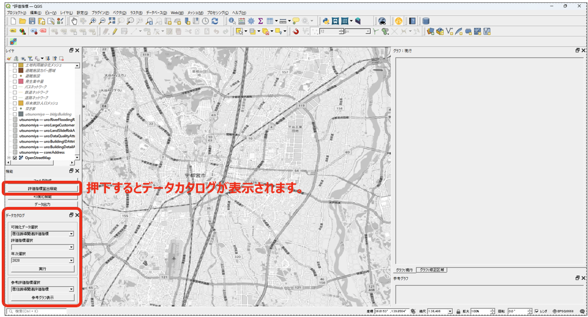

2. 可視化データを選択します。

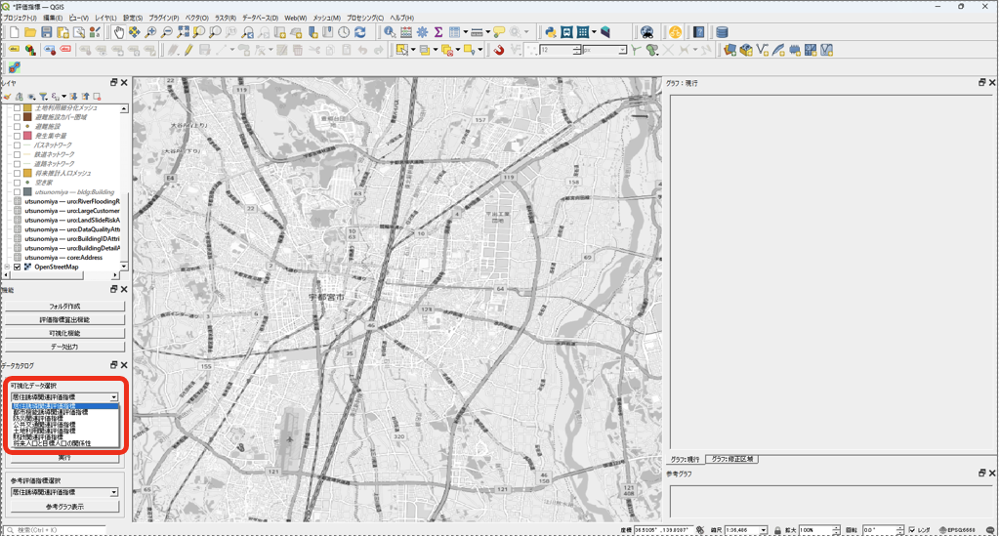

3. 評価指標を選択します。

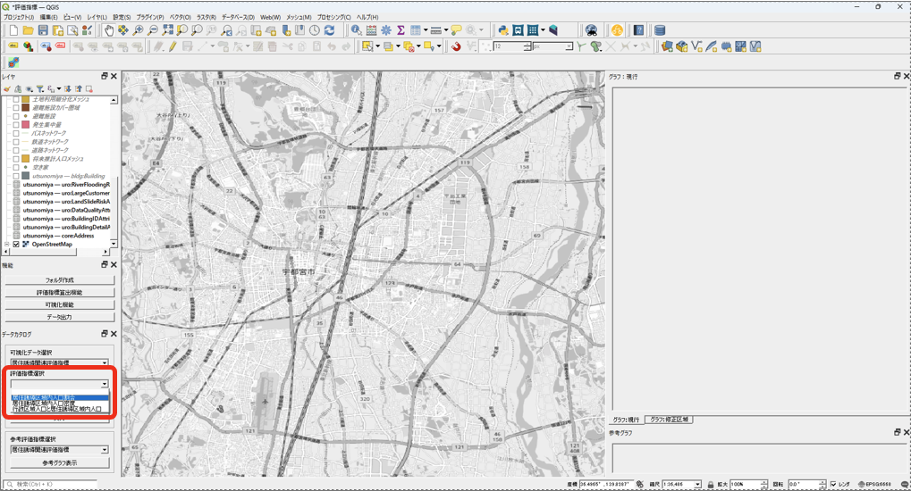

4. 年次を選択します。

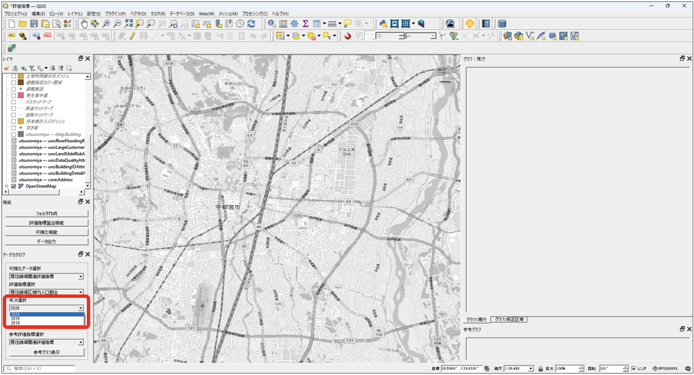

5. 実行ボタンを押下すると、選択した指標に該当するレイヤの凡例、マップ、グラフが表示されます。

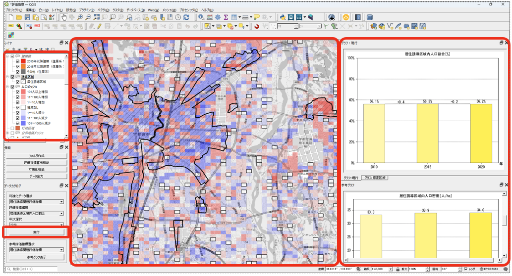

6. 評価指標を選択し、参考グラフ表示ボタンを押下すると選択した指標の参考グラフが表示されます。

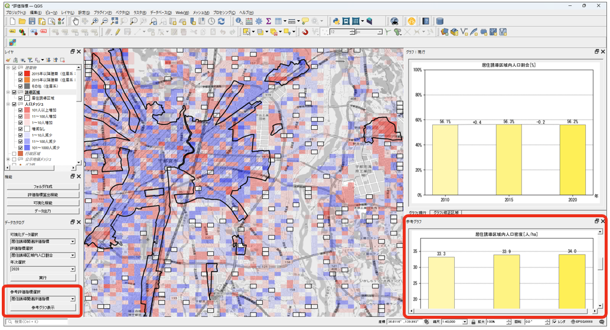

## 2-5 データ出力

1. 機能パネル内の【データ出力】を押下しデータ格納先フォルダを指定します。

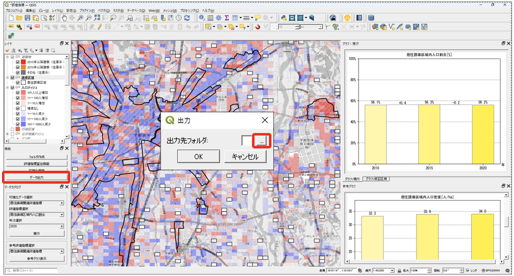

2. OKボタンを押下すると評価指標算出機能で算出した各指標に基づくデータを出力することができます。

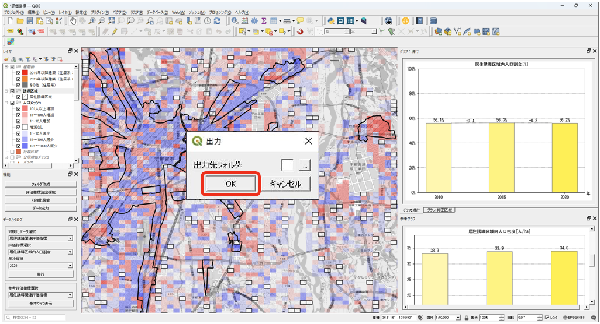

3. データがzip形式にまとめて出力されます。

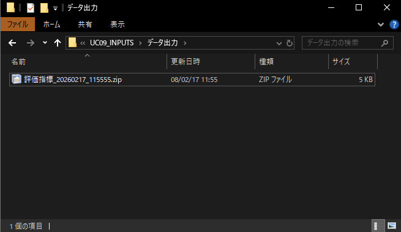

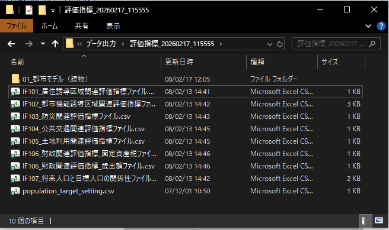

---
